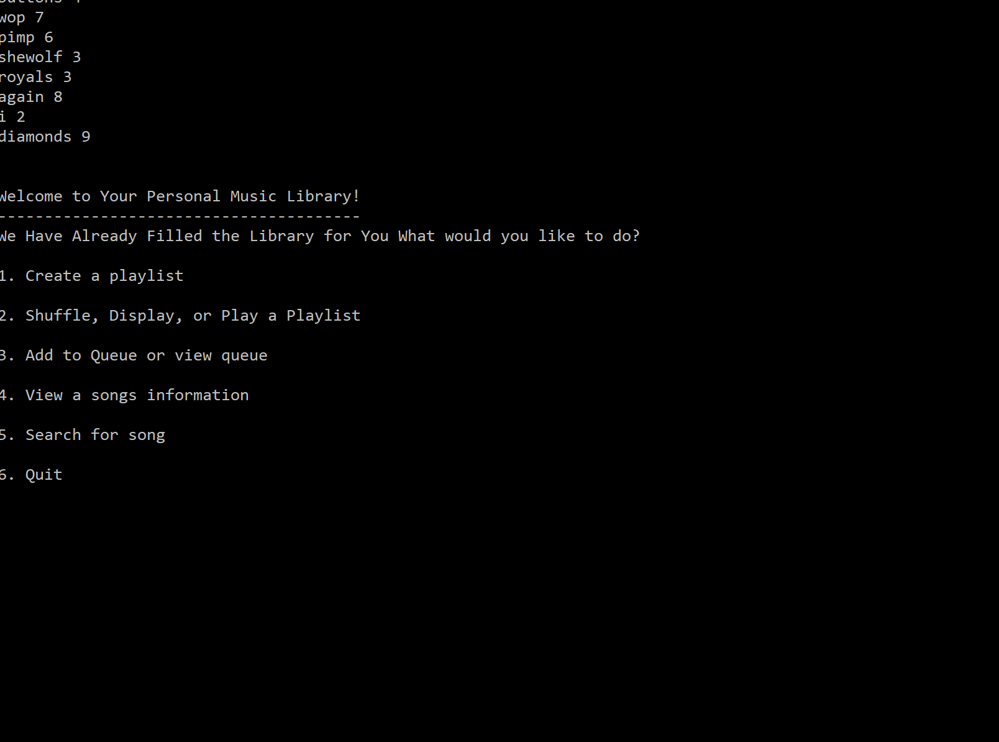

# Music-Library
This is a Trie implemented data structure for a music library similiar to an extremely primitive Spotify or Apple Music

# Features
- Auto updating search. The program uses a the Trie data structure to implement an autoupdating search. It is a proof of concept showing the usefullness of a trie for this specific task.
- The library can create queue's, playlists, add remove songs. General basic overview
- Written in C++, the Trie is completely implemented from scratch. Below is a sample of code outlining the definition of individual nodes.

`struct node
{
    char name;
    node *children[26];
    node* parent;
    songNode* head;
    bool isempty;
    node()
    {
      parent = NULL;
      head = NULL;
      isempty = true;
      for (int i = 0; i < 26; i++)
      {
        children[i] = NULL;
      }
    }
};`

# Seeing the program in action

**This is an implementation of the create playlist function and the add too queue function,
all the songs are stored in a Trie array then pointers in a priority queue and arrays point to
the song.**

**This is an implementation of the auto-search and display function you can see the search function
iterating through the trie based on the corresponding letters. It makes it very easy to store and 
search with suggestions.**

# More Info

The Trie is comprised of Trie nodes that hold song nodes and 26 children, one for each letter. The
song nodes comprise a songname, artist and prioritynum. They are randomized at the beginning, there
is no storage for mp3's but the idea was to focus on Trie's.
